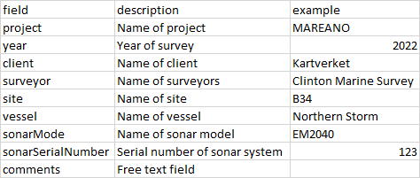
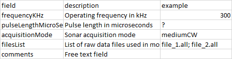
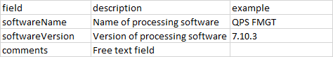
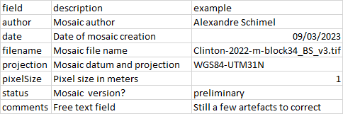
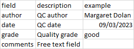
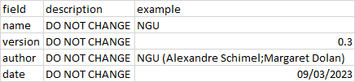
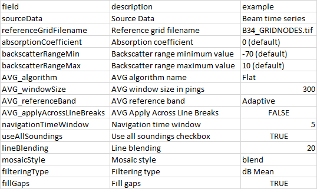
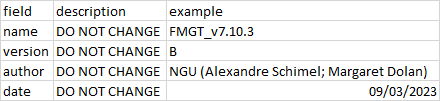

# bs-metadata

## Background

So you have just createed a multibeam backscatter mosaic in your software and exported it as a .tif file. How do you inform the users what this file is about?

Typically, you would put some information in the file's name. Survey area, year, the word "backscatter", maybe the sonar model and the grid size?

Congratulations you have started creating metadata!

The problem is that file names can't be excessively long so what about all the rest of the information? What about the frequency, the software used, the processing applied, the files that went in, or even your name as the author?

For a proper data management practice, you should compile all that information into a single place that lives alongside the mosaic. For even better practice, you would follow a template, and write this information in manner that is readable both by humans and machines.

This repository proposes such a template

## Philosophy

* Human-friendliness:
    * Enough fields to provide a good overview, but few enough to not be overwhelmed.
    * Unambiguous field names
    * Broken down in sections

* Machine-friendliness:
    * Version control

## Basic template

The template is organized into 6 sections, or nodes:

### 1. survey
A section containing the basic information about the 'survey':



### 2. data
A section containing the basic information about the 'data' that went into the mosaic:



### 3. processing
A section containing the basic information about the 'processing' applied (to be augmented later):



### 4. mosaic
A section containing the basic information about the 'mosaic' thus created:



### 5. qualityControl
A section containing the basic information about any 'quality control' performed:



### 6. metadata
A section containing information about this 'metadata' template:



## Augmenting the processing section

Additional information would be welcome for the processing applied, but it is dependent on the processing software. Here's for example a set of fields that are applicable to software FMGT v7.10.3:



In order to allow this augmentation, we need a separate version-control system just for this template:



## In practice

We recommend the JSON format for human- and machine-readability (see example below), but you can also use other formts such as XML or MarkDown.

```
{
    "metadata": {
        "name": "NGU",
        "version": "0.3",
        "author": "Alexandre Schimel, Margaret Dolan",
        "date": "09/03/2023"
    },
    "survey": {
        "project": "MAREANO",
        "year": 2022,
        "client": "Kartverket",
        "surveyor": "Clinton",
        "site": "B34",
        "vessel": "Northern Storm",
        "sonarModel": "EM2040",
        "sonarSerialNumber": "?",
        "comments": "None"
    },
    "data": {
        "frequencyKHz": "300",
        "pulseLengthMicroSec": "?",
        "acquisitionMode": "MediumCW",
        "filesList": ["file_1.all", "file_2,all"],
        "comments": "None"
    },
    "processing": {
        "softwareName": "FMGT",
        "softwareVersion": "7.10.3",
        "comments": "None",
        "processingMetadataName": "FMGT_v7.10.3",
        "processingMetadataVersion": "B",
        "sourceData": "Beam time series",
        "referenceGridFilename": "B34_GRIDNODES.tif",	
        "absorptionCoefficient": "0 (default)",
        "backscatterRangeMin": "-70 (default)",
        "backscatterRangeMax": "10 (default)",
        "AVG_algorithm": "Flat",
        "AVG_windowSize": 300,
        "AVG_referenceBand": "Adaptive",
        "AVG_applyAcrossLineBreaks": false,
        "navigationTimeWindow": 5,
        "useAllSoundings": true,
        "lineBlending": 20,
        "mosaicStyle": "blend",
        "filteringType": "dB Mean",
        "fillGaps": true
    },
    "mosaic": {
        "author": "Alexandre Schimel",
        "date": "09/03/2023",
        "filename": "Clinton-2022-m-block34_BS_v3.tif",
        "projection": "WGS84-UTM31N",
        "pixelSize": 1,
        "status": "preliminary",
        "comments": "Still a few artefacts to correct"
    },
    "qualityControl": {
        "author":"Margaret Dolan",
        "date": "09/03/2023",
        "grade": "good",
        "comments": "None"
    }
}
```
